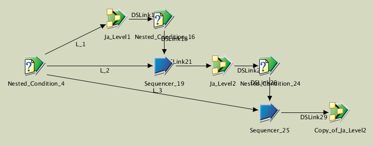
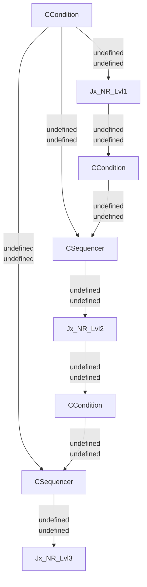

# Js_NR

**undefined**

| Key               | Val                                      |
| ----------------- | ---------------------------------------- |
| Category          | \T_NR                                    |
| type              | Sequence job                             |
| last modification | 2020/05/07 14:53:23 isadmin              |
| checksum          | 497d5ee5ea927f65a8f6d04f713b57559af96aac |

## Parameters

| Parameter | Prompt              | Default          |
| --------- | ------------------- | ---------------- |
| Ps_NR_Db  | Ps_NR_Db parameters | (As pre-defined) |
| table     | table               |                  |
| level     | level               | 2                |

## Inputs

| Name               | Type        |
| ------------------ | ----------- |
| Nested_Condition_4 | JSCondition |

## Outputs

| Name              | Type          |
| ----------------- | ------------- |
| Copy_of_Ja_Level2 | JSJobActivity |

## Graph

