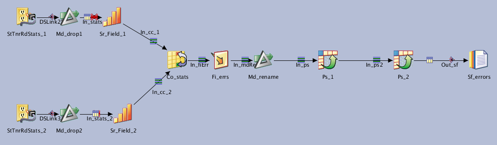
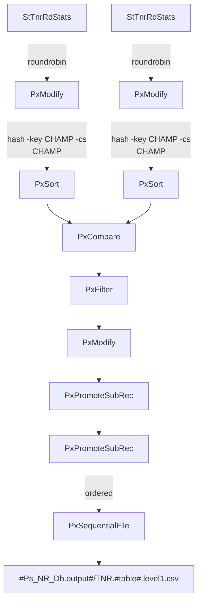

# Jx_NR_Lvl1x

**[TNR] Level 1 : Statistics comparison**

| Key               | Val                                      |
| ----------------- | ---------------------------------------- |
| Category          | \T_NR                                    |
| type              | Parallel job                             |
| last modification | 2020/07/13 06:52:05 isadmin              |
| checksum          | 979ee6abdd65becc768b8b262e53b4319b695f0f |

NSITBIM - 20200506 - Init

Compares 2 statistics files and generates a report with one line for each field that has a difference on one of the metrics bellow:

* numberOfValues
* minimum
* maximum
* sum
* mean

The job calls [Jx_NR_Lvl1_0](../jobs/Jx_NR_Lvl1_0) in the job's control code to generate the statistics files.

## Dependencies

* [Job Jx_NR_Lvl1_0](../jobs/Jx_NR_Lvl1_0)

## Parameters

| Parameter | Prompt              | Default          |
| --------- | ------------------- | ---------------- |
| Ps_NR_Db  | Ps_NR_Db parameters | (As pre-defined) |
| table     | table               |                  |

## Inputs

| Name           | Type         |
| -------------- | ------------ |
| StTnrRdStats_1 | StTnrRdStats |
| StTnrRdStats_2 | StTnrRdStats |

## Outputs

| Name      | Type             |
| --------- | ---------------- |
| Sf_errors | PxSequentialFile |

## Graph

