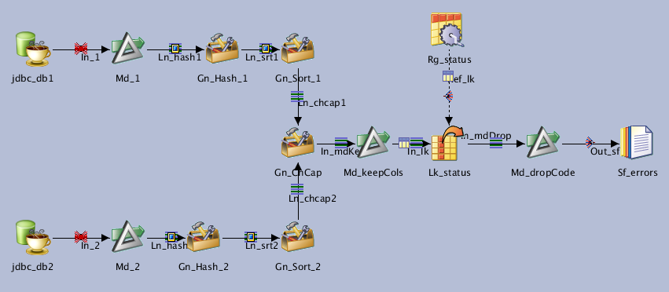
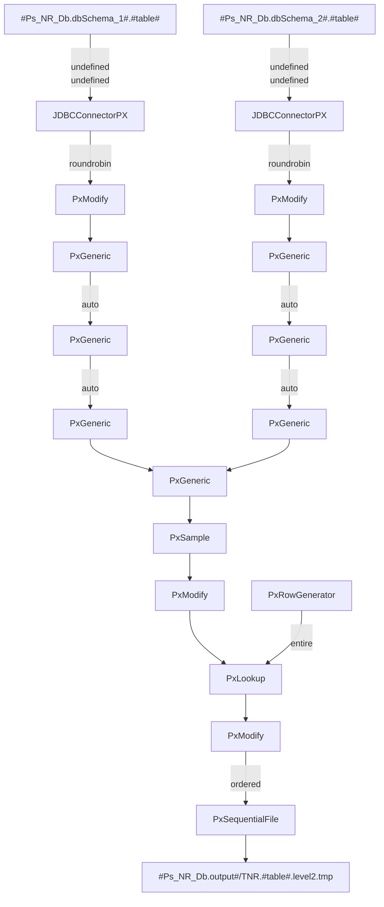

# Jx_NR_Lvl2

**[TNR] Level 2 : Simple table comparison**

| Key               | Val                                      |
| ----------------- | ---------------------------------------- |
| Category          | \T_NR                                    |
| type              | Parallel job                             |
| last modification | 2020/08/07 09:02:48 isadmin              |
| checksum          | 3f352b41c63e5059c481188b6cf1800f946643cf |

NSITBIM - 20200807 -  Update

* Options OutPercent: samples a percentage of produced rows
* Options OutMax: outputs only *OutMax* first rows (default 0 outputs all rows)

**OutPercent preceds OutMax**

NSITBIM - 20200520 -  Update

In case of table with no primary key generates a checksum for all columns and uses the result as key

NSITBIM - 20200506 - Init

Compares 2 tables and generates a report for each inserted, deleted, modified line. The report contains only the key values and the type of difference

## Dependencies

* [Routine RtTnrGetKeys](../routines/RtTrnGetKeys)

## Parameters

| Parameter  | Prompt              |
| ---------- | ------------------- |
| table      | Table               |
| keys       | Keys                |
| Md_Before  | Md_Before           |
| Md_After   | Md_After            |
| Ps_NR_Db   | Ps_NR_Db parameters |
| OutPercent | OutPercent          |
| OutMax     | OutMax              |

## Inputs

| Name      | Type            | Server                          | Tables                        |
| --------- | --------------- | ------------------------------- | ----------------------------- |
| jdbc_db1  | JDBCConnectorPX | #Ps_NR_Db.dbConnectionString_1# | #Ps_NR_Db.dbSchema_1#.#table# |
| jdbc_db2  | JDBCConnectorPX | #Ps_NR_Db.dbConnectionString_2# | #Ps_NR_Db.dbSchema_2#.#table# |
| Rg_status | PxRowGenerator  |                                 |                               |

## Outputs

| Name      | Type             |
| --------- | ---------------- |
| Sf_errors | PxSequentialFile |

## Graph

