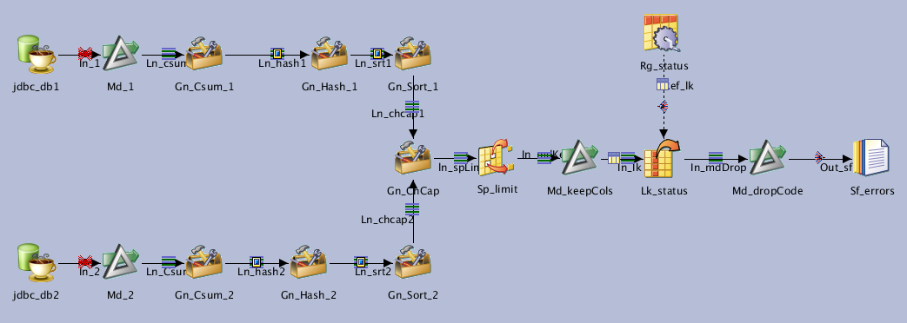

# Jx_NR_Lvl2

**[TNR] Level 2 : Simple table comparison**

| Key               | Val                                      |
| ----------------- | ---------------------------------------- |
| Category          | \T_NR                                    |
| type              | Parallel job                             |
| last modification | 2020/05/07 14:53:34 isadmin              |
| checksum          | ee6438cb2c82b5ea9976ffcbe8e167f59797237a |

NSITBIM - 20200506 - Init

Compares 2 tables and generates a report for each inserted, deleted, modified line. The report contains only the key values and the type of difference

## Dependencies

* [Routine RtTnrGetKeys](../routines/RtTrnGetKeys)

## Parameters

| Parameter | Prompt              |
| --------- | ------------------- |
| table     | Table               |
| keys      | Keys                |
| Md_Before | Md_Before           |
| Md_After  | Md_After            |
| Ps_NR_Db  | Ps_NR_Db parameters |

## Inputs

| Name      | Type            | Server                          | Tables                        |
| --------- | --------------- | ------------------------------- | ----------------------------- |
| jdbc_db1  | JDBCConnectorPX | #Ps_NR_Db.dbConnectionString_1# | #Ps_NR_Db.dbSchema_1#.#table# |
| jdbc_db2  | JDBCConnectorPX | #Ps_NR_Db.dbConnectionString_2# | #Ps_NR_Db.dbSchema_2#.#table# |
| Rg_status | PxRowGenerator  |                                 |                               |

## Outputs

| Name      | Type             |
| --------- | ---------------- |
| Sf_errors | PxSequentialFile |

## Graph

