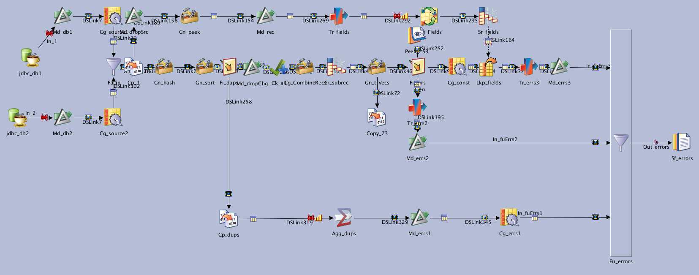

# Jx_NR_Lvl4


**[TNR] Level 3 : Deep table comparison**

| Key               | Val                                      |
| ----------------- | ---------------------------------------- |
| Category          | \T_NR                                    |
| type              | Parallel job                             |
| last modification | 2021/01/12 09:04:41 isadmin              |
| checksum          | a182799e500528d00fd8ce6c022146b234806f1c |




NSITBIM - 20200506 - Init

Compares 2 tables and generates a report with one line  for each column that has a difference:
* Level:field: level of comparison and field name
* Before: value of the field before
* After: value of the field after
* Keys: value of the keys

Most differences should be of level 3 but inserted/deleted lines (level 2)  and duplicates (level 3) will also be present.

Parameters `Md_Before` and `Md_After` can be used to convert or drop columns that are to be ignored or unhandled data types (e.g. floats are not correctly compared by datastage, they should be converted to decimal).


## Dependencies

* [Routine RtTnrGetKeys](../routines/RtTrnGetKeys)


## Parameters

| Parameter | Prompt              | Default          |
| --------- | ------------------- | ---------------- |
| Md_Before | Md_Before           | nowarn           |
| Md_After  | Md_After            | nowarn           |
| keys      | Keys                |                  |
| Ps_NR_Db  | Ps_NR_Db parameters | (As pre-defined) |
| table     | Table               |                  |


## Inputs

| Name     | Type            | Server                          | Tables                        |
| -------- | --------------- | ------------------------------- | ----------------------------- |
| jdbc_db1 | JDBCConnectorPX | #Ps_NR_Db.dbConnectionString_1# | #Ps_NR_Db.dbSchema_1#.#table# |
| jdbc_db2 | JDBCConnectorPX | #Ps_NR_Db.dbConnectionString_2# | #Ps_NR_Db.dbSchema_2#.#table# |


## Outputs

| Name      | Type             |
| --------- | ---------------- |
| Copy_73   | PxCopy           |
| Sf_errors | PxSequentialFile |
| Peek_253  | PxPeek           |


## Graph

```mermaid
```

