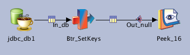

# Jx_NR_00_GetKeys


**Extract primary keys of  a table**

| Key               | Val                                      |
| ----------------- | ---------------------------------------- |
| Category          | \T_NR\jobs                               |
| type              | Parallel job                             |
| last modification | 2020/05/07 10:16:50 isadmin              |
| checksum          | 5fb8f1bbb26f8db47fd6f0dfe24945f48f7fd737 |




NSITBIM - 20200506 - Init

Execute the defined query to extract the keys.

This job is a used as a dependency to dynamicaly find a table's primary keys if those are not specified on execution.

The query must only return one column `NAME`

The transformer is a BASIC in order to call the routine `RtTnrSetKey` that appends each key and sets them in the job UserStatus and environnement variables.

The specifed query can containes paremeters `#table#` and `#Ps_NR_Db.dbSchema_1#`, those are resolved in the Job's Control code (see Job control panel in the job properties)

## Dependencies

* [Routine RtTnrSetKey](../../routines/RtTnrSetKey)


## Parameters

| Parameter | Prompt              |
| --------- | ------------------- |
| table     | Table               |
| Ps_NR_Db  | Ps_NR_Db parameters |


## Inputs

| Name     | Type            | Server                          | Tables   |
| -------- | --------------- | ------------------------------- | -------- |
| jdbc_db1 | JDBCConnectorPX | #Ps_NR_Db.dbConnectionString_1# | [&Query] |


## Outputs

| Name    | Type   |
| ------- | ------ |
| Peek_16 | PxPeek |


## Graph

```mermaid
graph TD;[&Query]["[&Query]"]-->|<br/>undefined<br/>undefined|jdbc_db1["JDBCConnectorPX"];jdbc_db1["JDBCConnectorPX"]-->|<br/>auto<br/>|Btr_SetKeys["PxSVTransformer"];Btr_SetKeys["PxSVTransformer"]-->|<br/>|Peek_16["PxPeek"]
```

