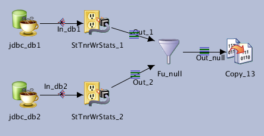
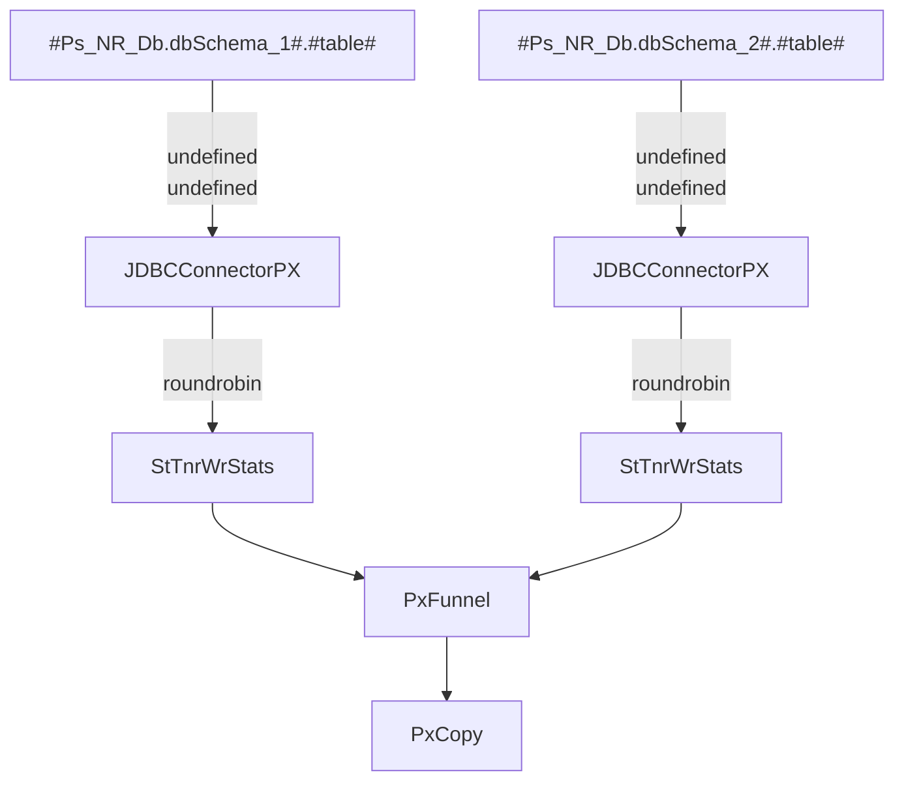

# Jx_NR_Lvl1_0

**Generate satistics for 2 tables**

| Key               | Val                                      |
| ----------------- | ---------------------------------------- |
| Category          | \T_NR\jobs                               |
| type              | Parallel job                             |
| last modification | 2020/05/07 12:55:14 isadmin              |
| checksum          | 7268e419eb82040493130422f49f3409d3e70cde |

NSITBIM - 20200506 - Init

Select all fields for 2 tables to compare and generate statistics for each numeric field of each table.

This job is a used as a dependency for the Level 1 job [Jx_NR_Lvl1](../../Jx_NR_Lvl1)

It uses a custom stage implementation of the statistics operator

## Dependencies

* [Stage StTnrWrStats](../../stages/StTnrWrStats)

## Parameters

| Parameter | Prompt              | Default          |
| --------- | ------------------- | ---------------- |
| Ps_NR_Db  | Ps_NR_Db parameters | (As pre-defined) |
| table     | table               |                  |

## Inputs

| Name     | Type            | Server                          | Tables                        |
| -------- | --------------- | ------------------------------- | ----------------------------- |
| jdbc_db1 | JDBCConnectorPX | #Ps_NR_Db.dbConnectionString_1# | #Ps_NR_Db.dbSchema_1#.#table# |
| jdbc_db2 | JDBCConnectorPX | #Ps_NR_Db.dbConnectionString_1# | #Ps_NR_Db.dbSchema_2#.#table# |

## Outputs

| Name    | Type   |
| ------- | ------ |
| Copy_13 | PxCopy |

## Graph

